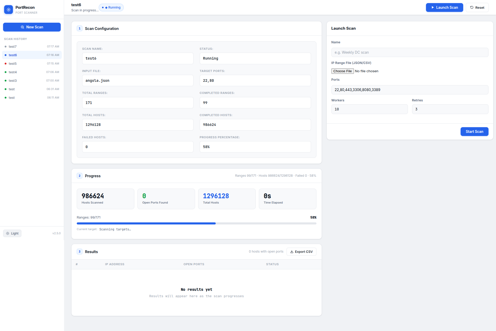

# PortRecon

PortRecon is a web-based bulk port scanning tool with ultra-fast performance + parallelism with background processing. 




### Features
- **Bulk Scanning**: Scan large IP ranges with ease.
- **Customizable**: Set ports, workers, and retries.
- **Real-time Progress**: Monitor scan progress live.
- **Output Management**: View and manage scan results in the UI.
- **Lightweight**: Built with FastAPI and Tortoise ORM for efficiency.
- **Background Processing**: Scans run in the background, allowing you to continue using the app.
- **Api First**: Designed with an API-first approach for easy integration and extensibility. Api is accessable from `/docs` endpoint.

## Prerequisites

- `uv`
- `make`

## Run

From the project root:

```bash
make run
```

Then open the "http://localhost:18681" in your browser (the URL shown in terminal output).

## Basic Usage

1. Open the New Scan form in the UI.
2. Upload an IP ranges file (`.json` or `.csv`).
3. Set ports, workers, and retries.
4. Start the scan and monitor live progress

## Input File Format

Supported formats:

- JSON
	```
  [
  "103.73.34.0-103.73.34.255",
  "109.105.159.0-109.105.159.255",
  "109.68.120.0-109.68.127.255",
  "109.75.32.0-109.75.47.255",
  "129.134.191.0-129.134.191.255",
  "130.193.120.0-130.193.127.255",
  "130.193.27.0-130.193.27.255",
  "130.248.84.0-130.248.85.255",
  "130.49.66.0-130.49.66.255",
  "138.249.174.0-138.249.174.255",
  "138.249.254.0-138.249.254.255",
  "139.28.4.0-139.28.4.255",
  "139.45.214.0-139.45.214.255",
  "141.136.64.0-141.136.95.255",
  "146.185.248.0-146.185.248.255"
  ]
  ```
- CSV/TXT
	- two columns: `start_ip,end_ip`


## ⚠️ Warning

This project is provided for **educational purposes only**.

- Use it only on systems and networks you own or have explicit permission to test.
- Unauthorized scanning may violate laws, policies, or terms of service.
- You are fully responsible for how you use this software.
